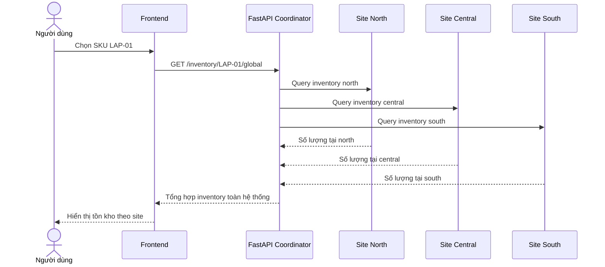
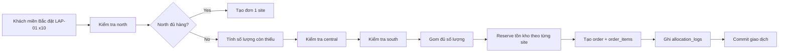

# Phân tích nghiệp vụ

## 1. Bối cảnh bài toán

Doanh nghiệp thương mại điện tử trong đề tài có nhiều kho hàng đặt tại các khu vực khác nhau. Mỗi kho vận hành tương đối độc lập trong việc quản lý tồn kho, xử lý đơn hàng và cập nhật trạng thái hàng hóa. Tuy nhiên, phía người dùng cuối và quản trị viên vẫn cần một góc nhìn toàn hệ thống để:

- tra cứu tồn kho của một sản phẩm trên toàn quốc
- đặt hàng theo vùng khách hàng
- xử lý trường hợp kho gần nhất không đủ hàng
- tổng hợp báo cáo doanh thu từ nhiều site
- chứng minh hệ thống vẫn nhất quán khi có nhiều giao dịch đồng thời

Trong hệ thống demo hiện tại, ba site được mô phỏng là:
- **north**: miền Bắc
- **central**: miền Trung
- **south**: miền Nam

## 2. Mục tiêu nghiệp vụ

Đề tài không chỉ yêu cầu tạo một cơ sở dữ liệu lưu trữ thông tin bán hàng, mà còn yêu cầu thể hiện rõ **đặc trưng của hệ quản trị cơ sở dữ liệu phân tán**. Vì vậy, mục tiêu của hệ thống bao gồm hai lớp:

### 2.1. Mục tiêu nghiệp vụ
- quản lý sản phẩm và danh mục sản phẩm
- quản lý thông tin kho hàng theo vùng
- quản lý tồn kho tại từng kho
- quản lý khách hàng
- tạo và theo dõi đơn hàng
- hỗ trợ đặt hàng từ nhiều kho khác nhau
- hỗ trợ báo cáo phục vụ quản trị

### 2.2. Mục tiêu phân tán
- phân bố dữ liệu theo site
- nhân bản dữ liệu dùng chung để giảm truy vấn xuyên site
- hỗ trợ truy vấn toàn hệ thống thông qua middleware
- giảm rủi ro âm tồn kho khi có giao dịch đồng thời
- mô phỏng cách điều phối đơn hàng giữa nhiều site

## 3. Các thực thể nghiệp vụ chính

Trong phiên bản demo, hệ thống sử dụng các thực thể sau:

### 3.1. Dữ liệu dùng chung (replicated data)
- **categories**: lưu mã danh mục, tên danh mục, mô tả
- **products**: lưu SKU, tên sản phẩm, giá, danh mục
- **warehouses**: lưu mã kho, site sở hữu, tên kho, thành phố, vùng

Đây là nhóm dữ liệu ít thay đổi nhưng được đọc rất thường xuyên ở mọi site.

### 3.2. Dữ liệu cục bộ theo site (fragmented data)
- **customers**: khách hàng được phân theo vùng
- **inventory**: tồn kho theo từng kho và SKU
- **orders**: thông tin đơn hàng gắn với site xử lý chính
- **order_items**: chi tiết sản phẩm của đơn hàng
- **allocation_logs**: log phân bổ hàng từ các kho khác nhau
- **inventory_audit**: log reserve, commit, release phục vụ chứng minh nhất quán

## 4. Chức năng nghiệp vụ chính

### 4.1. Quản lý danh mục và sản phẩm
- xem danh sách sản phẩm
- xem chi tiết sản phẩm theo SKU
- phân loại sản phẩm theo danh mục

### 4.2. Quản lý kho và tồn kho
- xem số lượng tồn tại từng kho
- xem tổng tồn trên toàn hệ thống
- phát hiện bản ghi tồn thấp hơn hoặc bằng ngưỡng reorder

### 4.3. Quản lý khách hàng và đơn hàng
- tạo đơn hàng theo mã khách hàng
- xác định site ưu tiên theo vùng khách hàng
- tạo đơn hàng ngay cả khi cần lấy hàng từ nhiều site
- truy xuất lại chi tiết đơn và allocation sau khi tạo

### 4.4. Báo cáo quản trị
- doanh thu theo site
- top sản phẩm bán chạy
- đơn hàng được phân bổ từ nhiều kho

### 4.5. Mô phỏng đồng thời
- hai khách cùng đặt một SKU trong cùng thời điểm
- hệ thống phải đảm bảo không âm tồn kho
- request thất bại phải được rollback đúng cách

## 5. Tình huống phân tán tiêu biểu

## 5.1. Tra cứu tồn kho toàn hệ thống
Đây là tình huống cho thấy rõ nhất ý nghĩa của hệ phân tán.

Người dùng nhập một SKU, ví dụ `LAP-01`. Middleware sẽ:
1. gửi truy vấn tới 3 site
2. đọc tồn kho cục bộ từ từng site
3. tổng hợp kết quả về một phản hồi thống nhất
4. trả về tổng tồn, tổng reserved và chi tiết từng kho

### Sơ đồ luồng tra cứu tồn kho

## 5.2. Đặt hàng khi kho gần nhất không đủ
Đây là tình huống thể hiện rõ nhất cơ chế phân bổ đa kho.

Ví dụ khách ở miền Bắc đặt `LAP-01` số lượng `10`:
- kho miền Bắc chỉ còn `2`
- kho miền Trung còn `0`
- kho miền Nam còn `8`

Khi đó middleware sẽ:
1. ưu tiên site north trước
2. lấy tiếp từ south để đủ số lượng
3. tạo đơn hàng với `primary_site_code = north`
4. ghi allocation logs cho cả north và south

### Sơ đồ luồng đặt hàng đa kho

## 5.3. Đồng thời và nhất quán
Đây là tình huống kỹ thuật quan trọng để chứng minh hệ thống phân tán không chỉ “truy vấn được”, mà còn “giữ được tính đúng đắn dữ liệu”.

Hai khách có thể cùng đặt một sản phẩm tại cùng một thời điểm. Nếu không khóa đúng bản ghi tồn kho, cả hai transaction có thể cùng đọc một giá trị tồn ban đầu và cùng trừ đi, dẫn tới âm kho.

Trong hệ thống demo, điều này được xử lý bằng:
- `SELECT ... FOR UPDATE`
- cơ chế `available_qty` / `reserved_qty`
- release phần đã reserve nếu request không đi tới commit thành công
- ghi `inventory_audit` để chứng minh từng bước thay đổi

## 6. Giá trị của hệ thống demo đối với bài tập

Bản demo hiện tại có giá trị tốt cho đồ án vì thể hiện được ba lớp khác nhau:

1. **Lớp dữ liệu**: có lược đồ toàn cục, dữ liệu nhân bản và dữ liệu phân mảnh
2. **Lớp điều phối**: FastAPI làm coordinator gom và phân phối dữ liệu giữa các site
3. **Lớp trình diễn**: frontend React hiển thị rõ các flow phân tán một cách trực quan

Nhờ đó, đồ án không chỉ dừng ở mức “thiết kế lý thuyết”, mà còn có một bản minh họa có thể chạy và thuyết trình rõ ràng.
