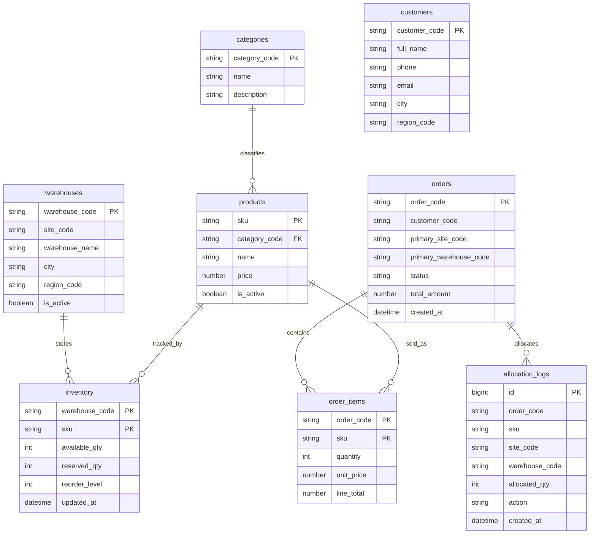

# Lược đồ toàn cục

## 1. Quan điểm thiết kế

Lược đồ toàn cục là góc nhìn logic thống nhất của toàn bộ hệ thống, không phụ thuộc dữ liệu đang được lưu ở site nào. Người thiết kế trước hết phải mô tả toàn bộ dữ liệu như một hệ thống thống nhất, sau đó mới quyết định bảng nào cần nhân bản và bảng nào cần phân mảnh.

Trong đồ án này, lược đồ toàn cục được xây dựng theo hướng:
- dữ liệu danh mục và catalog là dùng chung trên toàn hệ thống
- dữ liệu tồn kho và giao dịch là cục bộ theo site
- middleware đóng vai trò nối các phần cục bộ lại thành hành vi toàn cục

## 2. Danh sách bảng trong lược đồ toàn cục

## 2.1. Bảng nhân bản ở mọi site
- `categories(category_code, name, description)`
- `products(sku, category_code, name, price, is_active)`
- `warehouses(warehouse_code, site_code, warehouse_name, city, region_code, is_active)`

## 2.2. Bảng phân mảnh theo site
- `customers(customer_code, full_name, phone, email, city, region_code)`
- `inventory(warehouse_code, sku, available_qty, reserved_qty, reorder_level, updated_at)`
- `orders(order_code, customer_code, primary_site_code, primary_warehouse_code, status, total_amount, created_at)`
- `order_items(order_code, sku, quantity, unit_price, line_total)`
- `allocation_logs(id, order_code, sku, site_code, warehouse_code, allocated_qty, action, created_at)`
- `inventory_audit(id, request_code, sku, warehouse_code, action, delta_available, delta_reserved, created_at)`

## 3. Vai trò của từng bảng

### 3.1. categories
Dùng để phân nhóm sản phẩm. Đây là dữ liệu ít thay đổi, cần xuất hiện giống nhau ở mọi site để tránh join xuyên site khi hiển thị catalog.

### 3.2. products
Bảng trung tâm của catalog, chứa SKU, tên và giá sản phẩm. Mọi site đều cần bản sao của bảng này vì cả tra cứu tồn kho, báo cáo và tạo đơn hàng đều phụ thuộc vào SKU.

### 3.3. warehouses
Mô tả kho nào thuộc site nào. Bảng này vừa là dữ liệu dùng chung, vừa là cầu nối giữa tầng logic toàn cục và tầng lưu trữ cục bộ.

### 3.4. customers
Khách hàng được lưu theo vùng. Điều này giúp phân bố dữ liệu theo địa lý và phù hợp với ý tưởng xử lý đơn hàng gần vùng của khách.

### 3.5. inventory
Đây là bảng quan trọng nhất ở lớp cục bộ. Nó giữ số lượng hàng thực tế còn có thể bán (`available_qty`) và số lượng đang giữ chỗ (`reserved_qty`).

### 3.6. orders và order_items
Hai bảng này lưu giao dịch bán hàng. `orders` đại diện cho phần đầu đơn hàng, còn `order_items` mô tả SKU và số lượng trong đơn.

### 3.7. allocation_logs
Dùng để thể hiện một đơn hàng đã được cấp phát từ những site/kho nào. Đây là bảng có giá trị lớn khi thuyết trình vì giúp nhìn thấy rõ split order.

### 3.8. inventory_audit
Lưu dấu vết các thao tác reserve, commit, release tồn kho. Đây là bằng chứng kỹ thuật để giải thích tính nhất quán dữ liệu khi có concurrency.

## 4. Ràng buộc logic giữa các bảng

### 4.1. Quan hệ giữa categories và products
- một danh mục có nhiều sản phẩm
- một sản phẩm thuộc đúng một danh mục

### 4.2. Quan hệ giữa warehouses và inventory
- một kho có nhiều bản ghi tồn kho
- mỗi bản ghi tồn kho gắn với một SKU cụ thể trong một kho cụ thể

### 4.3. Quan hệ giữa orders và order_items
- một đơn hàng có thể chứa nhiều dòng hàng
- mỗi dòng hàng thuộc về đúng một order

### 4.4. Quan hệ giữa orders và allocation_logs
- một đơn hàng có thể được cấp phát từ một hoặc nhiều kho
- `allocation_logs` ghi lại số lượng đã cấp phát cho từng site/kho

## 5. Sơ đồ lược đồ toàn cục

## 6. Liên hệ giữa lược đồ toàn cục và demo hiện tại

Các file code và SQL đang bám đúng lược đồ này:
- `sql/global/00-global-schema.sql`
- `sql/site1/01-schema.sql`
- `sql/site2/01-schema.sql`
- `sql/site3/01-schema.sql`

Do đó, phần tài liệu và phần cài đặt hiện đang tương thích trực tiếp với nhau, rất thuận lợi khi đưa vào báo cáo hoặc trình bày phản biện.
