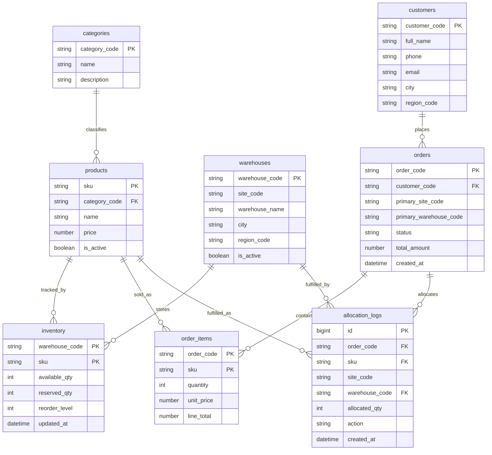

# Lược đồ toàn cục

## 1. Quan điểm thiết kế

Lược đồ toàn cục là góc nhìn logic thống nhất của toàn bộ hệ thống, không phụ thuộc dữ liệu đang được lưu ở site nào. Người thiết kế trước hết phải mô tả toàn bộ dữ liệu như một hệ thống thống nhất, sau đó mới quyết định bảng nào cần nhân bản và bảng nào cần phân mảnh.

Lược đồ toàn cục được xây dựng theo hướng:

- dữ liệu danh mục là dùng chung trên toàn hệ thống
- dữ liệu tồn kho và giao dịch là cục bộ theo site
- middleware đóng vai trò nối các phần cục bộ lại thành hành vi toàn cục

## 2. Danh sách bảng trong lược đồ toàn cục

## 2.1. Bảng nhân bản ở mọi site

- `categories(category_code, name, description)`
- `products(sku, category_code, name, price, is_active)`
- `warehouses(warehouse_code, site_code, warehouse_name, city, region_code, is_active)`

## 2.2. Bảng phân mảnh theo site

- `customers(customer_code, full_name, phone, email, city, region_code)`
- `inventory(warehouse_code, sku, available_qty, reserved_qty, reorder_level, updated_at)`
- `orders(order_code, customer_code, primary_site_code, primary_warehouse_code, status, total_amount, created_at)`
- `order_items(order_code, sku, quantity, unit_price, line_total)`
- `allocation_logs(id, order_code, sku, site_code, warehouse_code, allocated_qty, action, created_at)`
- `inventory_audit(id, request_code, sku, warehouse_code, action, delta_available, delta_reserved, created_at)`

## 3. Vai trò của từng bảng

### 3.1. categories

Dùng để phân nhóm sản phẩm. Đây là dữ liệu ít thay đổi, cần xuất hiện giống nhau ở mọi site.

### 3.2. products

Bảng trung tâm của catalog, chứa SKU, tên và giá sản phẩm. Mọi site đều cần bản sao của bảng này vì cả tra cứu tồn kho, báo cáo và tạo đơn hàng đều phụ thuộc vào SKU.

### 3.3. warehouses

Mô tả kho nào thuộc site nào. Bảng này vừa là dữ liệu dùng chung, vừa là cầu nối giữa tầng logic toàn cục và tầng lưu trữ cục bộ.

### 3.4. customers

Khách hàng được lưu theo vùng. Điều này giúp phân bố dữ liệu theo địa lý và phù hợp với ý tưởng xử lý đơn hàng gần vùng của khách.

### 3.5. inventory

Đây là bảng quan trọng nhất ở lớp cục bộ. Nó giữ số lượng hàng thực tế còn có thể bán (`available_qty`) và số lượng đang giữ chỗ (`reserved_qty`).

### 3.6. orders và order_items

Hai bảng này lưu giao dịch bán hàng. `orders` đại diện cho phần đầu đơn hàng, còn `order_items` mô tả SKU và số lượng trong đơn.

### 3.7. allocation_logs

Dùng để thể hiện một đơn hàng đã được cấp phát từ những site/kho nào. Đây là bảng có giá trị lớn khi thuyết trình vì giúp nhìn thấy rõ split order.

### 3.8. inventory_audit

Lưu dấu vết các thao tác reserve, commit, release tồn kho. Đây là bằng chứng kỹ thuật để giải thích tính nhất quán dữ liệu khi có concurrency.

## 4. Ràng buộc logic giữa các bảng

### 4.1. Quan hệ giữa `categories` và `products` (1 - N)

- một danh mục có thể chứa nhiều sản phẩm
- một sản phẩm chỉ thuộc đúng một danh mục

Ý nghĩa: Cho phép phân loại sản phẩm theo nhóm để:

- tìm kiếm
- thống kê
- hiển thị frontend

---

### 4.2. Quan hệ giữa `warehouses` và `inventory` (1 - N)

- một kho có thể lưu nhiều SKU
- mỗi bản ghi inventory thuộc đúng một kho

Ý nghĩa: Cho phép theo dõi tồn kho theo từng địa điểm vật lý.

---

### 4.3. Quan hệ giữa `products` và `inventory` (1 - N)

- một SKU có thể tồn tại ở nhiều kho khác nhau
- mỗi inventory record chỉ quản lý một SKU

Ý nghĩa: Đây là nền tảng của bài toán đa kho.

Điều này giúp hệ thống:

- truy vấn tồn kho toàn hệ thống
- thực hiện split-order
- điều phối fulfillment giữa nhiều site

---

### 4.4. Quan hệ giữa `customers` và `orders` (1 - N)

- một khách hàng có thể tạo nhiều đơn hàng
- mỗi order thuộc về đúng một khách hàng

Ý nghĩa: Cho phép:

- tra lịch sử mua hàng
- thống kê khách hàng
- xác định vùng ưu tiên fulfillment

---

### 4.5. Quan hệ giữa `orders` và `order_items` (1 - N)

- một đơn hàng có thể chứa nhiều dòng sản phẩm
- mỗi dòng hàng thuộc về đúng một đơn hàng

Ý nghĩa: Tách:

```text
header order
```

và:

```text
detail items
```

để dễ mở rộng.

---

### 4.6. Quan hệ giữa `products` và `order_items` (1 - N)

- một sản phẩm có thể xuất hiện trong nhiều order khác nhau
- mỗi order_item chỉ tham chiếu đến một SKU

Cho phép:

- thống kê top sản phẩm
- tính doanh thu theo SKU
- phân tích bán hàng

---

### 4.7. Quan hệ giữa `orders` và `allocation_logs` (1 - N)

- một order có thể được cấp phát bởi nhiều kho
- mỗi allocation log thuộc về một order cụ thể

Ý nghĩa: Để chứng minh:

```text
multi-warehouse fulfillment
```

Từ đó hệ thống có thể xác định:

- đơn nào bị split-order
- warehouse nào cấp bao nhiêu
- timeline fulfillment

---

### 4.8. Quan hệ giữa `products` và `allocation_logs` (1 - N)

- một SKU có thể được cấp phát trong nhiều order
- mỗi allocation log gắn với một SKU cụ thể

Giúp:

- audit cấp phát tồn kho
- thống kê lượng fulfillment theo sản phẩm
- debug transaction phân tán

---

### 4.9. Khóa chính kép trong `inventory`

Bảng:

```text
inventory
```

sử dụng khóa chính kép:

```text
(warehouse_code, sku)
```

Ý nghĩa:

Một kho chỉ có tối đa:

```text
1 bản ghi tồn kho / SKU
```

Ví dụ hợp lệ:

```text
HN-01 + LAP-01
```

Ví dụ không hợp lệ:

```text
HN-01 + LAP-01
HN-01 + LAP-01
```

(trùng SKU trong cùng kho)

---

### 4.10. Khóa chính kép trong `order_items`

Bảng:

```text
order_items
```

sử dụng khóa chính kép:

```text
(order_code, sku)
```

Ý nghĩa:

Trong cùng một order:

```text
mỗi SKU chỉ xuất hiện một lần
```

Tránh dữ liệu kiểu:

```text
ORD-001 + LAP-01 × 2
ORD-001 + LAP-01 × 3
```

thay vào đó:

```text
ORD-001 + LAP-01 × 5
```

## 5. Sơ đồ lược đồ toàn cục


```mermaid
erDiagram
    categories ||--o{ products : classifies

    warehouses ||--o{ inventory : stores
    products ||--o{ inventory : tracked_by

    customers ||--o{ orders : places

    orders ||--o{ order_items : contains
    products ||--o{ order_items : sold_as

    orders ||--o{ allocation_logs : allocates
    products ||--o{ allocation_logs : fulfilled_as
    warehouses ||--o{ allocation_logs : fulfilled_by

    categories {
        string category_code PK
        string name
        string description
    }

    products {
        string sku PK
        string category_code FK
        string name
        number price
        boolean is_active
    }

    warehouses {
        string warehouse_code PK
        string site_code
        string warehouse_name
        string city
        string region_code
        boolean is_active
    }

    customers {
        string customer_code PK
        string full_name
        string phone
        string email
        string city
        string region_code
    }

    inventory {
        string warehouse_code PK
        string sku PK
        int available_qty
        int reserved_qty
        int reorder_level
        datetime updated_at
    }

    orders {
        string order_code PK
        string customer_code FK
        string primary_site_code
        string primary_warehouse_code
        string status
        number total_amount
        datetime created_at
    }

    order_items {
        string order_code PK
        string sku PK
        int quantity
        number unit_price
        number line_total
    }

    allocation_logs {
        bigint id PK
        string order_code FK
        string sku FK
        string site_code
        string warehouse_code FK
        int allocated_qty
        string action
        datetime created_at
    }
```

## 6. Liên hệ giữa lược đồ toàn cục và demo hiện tại

Các file code và SQL đang bám đúng lược đồ này:

- `sql/global/00-global-schema.sql`
- `sql/site1/01-schema.sql`
- `sql/site2/01-schema.sql`
- `sql/site3/01-schema.sql`
