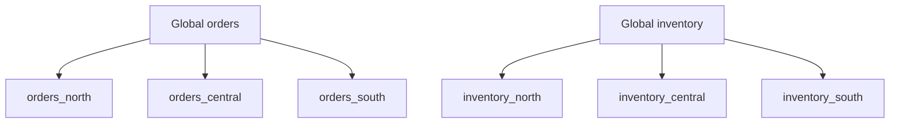
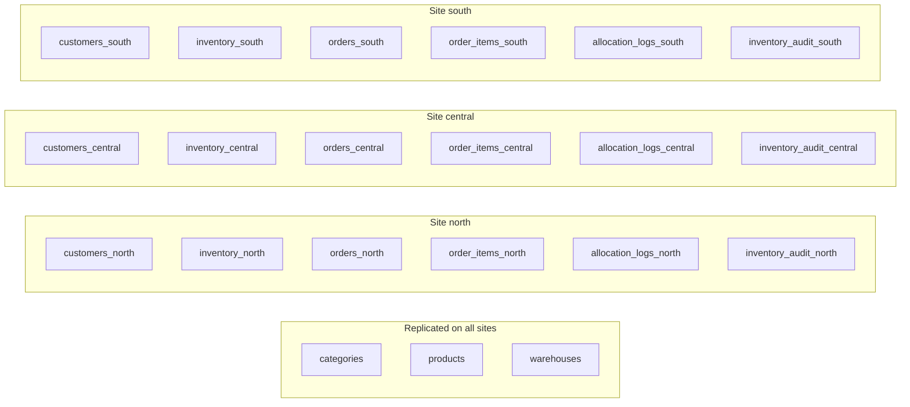

# Phân mảnh và cấp phát dữ liệu

## 1. Mục đích của phân mảnh

Trong hệ phân tán, không phải mọi dữ liệu đều nên đặt ở mọi nơi. Nếu toàn bộ dữ liệu được nhân bản toàn phần, hệ thống sẽ tốn chi phí đồng bộ rất lớn. Nếu ngược lại mọi dữ liệu đều chỉ tồn tại ở một chỗ, thì truy vấn xuyên site sẽ xảy ra thường xuyên và làm giảm hiệu năng.

Vì vậy, đồ án này lựa chọn mô hình cân bằng:
- **nhân bản dữ liệu dùng chung**
- **phân mảnh dữ liệu giao dịch theo site**

## 2. Mô hình site của hệ thống

Ba site được mô phỏng như sau:

| Site | Khu vực | Vai trò |
|------|---------|---------|
| north | Miền Bắc | Xử lý kho và khách hàng miền Bắc |
| central | Miền Trung | Xử lý kho và khách hàng miền Trung |
| south | Miền Nam | Xử lý kho và khách hàng miền Nam |

## 3. Chiến lược phân mảnh

## 3.1. Phân mảnh ngang theo site
Áp dụng cho:
- `customers`
- `inventory`
- `orders`
- `order_items`
- `allocation_logs`
- `inventory_audit`

### Ý tưởng
Mỗi site giữ phần dữ liệu mà nó sở hữu:
- khách hàng của vùng đó
- tồn kho của kho thuộc site đó
- đơn hàng mà site đó xử lý chính
- các log nghiệp vụ liên quan đến site đó

### Ví dụ trực quan

## 3.2. Nhân bản dữ liệu dùng chung
Áp dụng cho:
- `categories`
- `products`
- `warehouses`

### Lý do
Các bảng này:
- được đọc thường xuyên
- thay đổi ít
- cần xuất hiện ở mọi site để tránh join xuyên site

Điều này giúp:
- tra cứu sản phẩm nhanh
- hiển thị frontend nhất quán
- giảm độ phức tạp khi coordinator cần ghép dữ liệu

## 4. Cấp phát dữ liệu thực tế trong hệ thống demo

### Site north
- khách hàng miền Bắc
- tồn kho kho Hà Nội
- đơn hàng xử lý chính tại north
- log allocation và audit phát sinh tại north

### Site central
- khách hàng miền Trung
- tồn kho kho Đà Nẵng
- đơn hàng xử lý chính tại central
- log allocation và audit phát sinh tại central

### Site south
- khách hàng miền Nam
- tồn kho kho TP.HCM
- đơn hàng xử lý chính tại south
- log allocation và audit phát sinh tại south

## 5. Lý do lựa chọn chiến lược này

## 5.1. Tăng locality of reference
Phần lớn thao tác vận hành hằng ngày diễn ra ở phạm vi cục bộ của một site. Ví dụ:
- đọc tồn kho của kho địa phương
- tạo đơn hàng cho khách hàng trong vùng
- cập nhật tồn kho của kho đó

Do đó, việc giữ các bảng giao dịch ở site sở hữu dữ liệu giúp giảm truy cập từ xa.

## 5.2. Giảm chi phí join phân tán
Nhờ nhân bản `products`, `categories`, `warehouses`, frontend và middleware có thể:
- hiển thị tên sản phẩm
- hiển thị tên kho
- hiển thị site
mà không cần thực hiện join xuyên site mỗi lần tra cứu.

## 5.3. Dễ giải thích khi demo
Cấu trúc này rất phù hợp với đồ án vì:
- logic phân mảnh rõ
- logic nhân bản rõ
- dễ vẽ sơ đồ
- dễ chứng minh vì có thể chỉ thẳng dữ liệu nào là local, dữ liệu nào là shared

## 6. Sơ đồ phân mảnh và cấp phát

## 7. Liên hệ với code hiện tại

Phân mảnh trong bản demo không được cài bằng middleware replication tự động mà được mô phỏng bằng:
- 3 database PostgreSQL độc lập
- mỗi database có schema giống nhau
- dữ liệu seed khác nhau ở phần cục bộ
- FastAPI coordinator thực hiện truy vấn và điều phối giữa các site

Cách này phù hợp với đồ án vì dễ kiểm soát, dễ minh họa và đủ rõ để giải thích lý thuyết phân tán.
