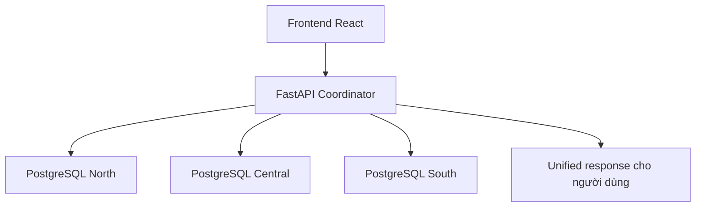

# Cơ chế nhân bản và đồng bộ dữ liệu

## 1. Mục tiêu của cơ chế nhân bản

Nhân bản dữ liệu trong hệ phân tán nhằm giải quyết ba bài toán chính:
- tăng tốc độ đọc dữ liệu dùng chung
- giảm số lần truy vấn xuyên site
- giữ cho các site có cùng hiểu biết về catalog sản phẩm và kho

Tuy nhiên, không phải bảng nào cũng nên nhân bản. Nếu nhân bản cả các bảng giao dịch như `orders` hay `inventory`, hệ thống sẽ tốn nhiều công sức đồng bộ và dễ phát sinh xung đột.

## 2. Dữ liệu được nhân bản trong đồ án

Trong hệ thống demo hiện tại, các bảng sau được xem là dữ liệu dùng chung và tồn tại ở cả 3 site:
- `categories`
- `products`
- `warehouses`

## 3. Vì sao chọn đúng 3 bảng này

## 3.1. categories
- ít thay đổi
- thường dùng để hiển thị và phân loại sản phẩm
- không mang tính giao dịch thời gian thực

## 3.2. products
- là danh mục sản phẩm toàn hệ thống
- mọi site đều cần hiểu cùng một SKU là cùng một sản phẩm
- dùng chung cho tồn kho, báo cáo, đơn hàng, giao diện frontend

## 3.3. warehouses
- dùng để biết kho nào thuộc site nào
- cần cho mọi site khi hiển thị allocation hoặc inventory global

## 4. Dữ liệu không nhân bản

Các bảng sau không được nhân bản toàn phần:
- `customers`
- `inventory`
- `orders`
- `order_items`
- `allocation_logs`
- `inventory_audit`

### Lý do
Đây là dữ liệu:
- cập nhật thường xuyên
- mang tính cục bộ cao
- dễ xung đột nếu sao chép toàn phần
- phù hợp hơn với mô hình phân mảnh ngang

## 5. Cơ chế đồng bộ trong bản demo

Do đồ án tập trung vào minh họa logic phân tán, bản demo hiện tại không triển khai replication engine tự động giữa các site. Thay vào đó, đồng bộ được mô phỏng theo hướng:

- dữ liệu dùng chung được seed giống nhau ở cả 3 site
- coordinator luôn giả định catalog là nhất quán giữa các site
- truy vấn toàn hệ thống được tạo bằng cách gọi từng site rồi tổng hợp kết quả
- giao dịch cập nhật tồn kho được điều phối từ middleware

Điều này phù hợp với mục tiêu môn học vì nhấn mạnh **logic phân tán**, không sa đà vào cấu hình replication chuyên sâu của một DBMS cụ thể.

## 6. Đồng bộ logic thông qua middleware

FastAPI middleware đóng vai trò coordinator ở giữa frontend và 3 site PostgreSQL.

### Coordinator thực hiện các nhiệm vụ sau
1. gửi truy vấn tới nhiều site
2. gom kết quả về một response chung
3. tính toán allocation khi một site không đủ hàng
4. giữ chỗ tồn kho bằng reserve trước khi commit
5. release phần đã reserve nếu transaction không hoàn tất

### Sơ đồ vai trò của coordinator

## 7. Đồng bộ trong truy vấn đọc và truy vấn ghi

## 7.1. Truy vấn đọc
Ví dụ tra cứu tồn kho toàn hệ thống:
- dữ liệu được đọc cục bộ ở mỗi site
- coordinator tổng hợp kết quả
- không cần sao chép bảng `inventory` sang site khác

## 7.2. Truy vấn ghi
Ví dụ tạo đơn hàng từ nhiều kho:
- coordinator reserve số lượng ở từng site
- ghi order ở site xử lý chính
- ghi allocation logs ở site tương ứng
- commit thành công ở các site liên quan
- nếu lỗi thì rollback và release phần đã reserve

## 8. Ưu điểm và hạn chế của cách làm hiện tại

### Ưu điểm
- dễ cài đặt
- phù hợp cho đồ án và demo trên máy cá nhân
- dễ giải thích phân biệt local data và shared data
- dễ kiểm soát luồng đọc/ghi giữa các site

### Hạn chế
- chưa có replication engine thật sự theo thời gian thực
- chưa có cơ chế tự đồng bộ khi catalog thay đổi
- chưa có distributed transaction manager hoàn chỉnh kiểu 2PC thực thụ

Tuy vậy, với phạm vi đồ án, mô hình này là hợp lý vì vẫn làm nổi bật các khái niệm quan trọng của cơ sở dữ liệu phân tán.
