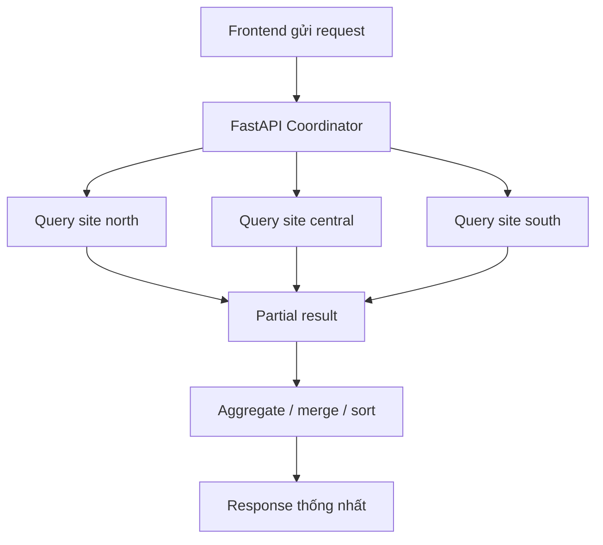

# Truy vấn phân tán

## 1. Mục đích của phần truy vấn phân tán

Một hệ phân tán chỉ thực sự có ý nghĩa khi có khả năng trả lời các câu hỏi toàn hệ thống dù dữ liệu nằm rải rác ở nhiều site. Trong đồ án này, các truy vấn phân tán được hiện thực thông qua FastAPI coordinator, thay vì yêu cầu người dùng truy vấn từng database riêng lẻ.

## 2. Danh sách truy vấn phân tán chính

## 2.1. Kiểm tra sản phẩm còn ở những kho nào
**Endpoint:** `GET /inventory/{sku}/global`

### Ý nghĩa
Cho biết một SKU hiện còn hàng tại site/kho nào, số lượng khả dụng là bao nhiêu, tổng reserved là bao nhiêu.

### Dữ liệu sử dụng
- `inventory` tại north, central, south
- `warehouses` để hiển thị tên kho và site

### Cách xử lý
1. coordinator gửi truy vấn tới cả 3 site
2. lấy các bản ghi tồn kho theo SKU
3. hợp nhất thành một response duy nhất
4. tính tổng available và reserved toàn hệ thống

### Ý nghĩa phân tán
Đây là truy vấn tiêu biểu nhất để chứng minh dữ liệu vật lý phân tán nhưng người dùng vẫn nhìn thấy một ảnh logic thống nhất.

---

## 2.2. Quote phân bổ đơn hàng theo vùng khách hàng
**Endpoint:** `POST /inventory/quote-fulfillment`

### Ý nghĩa
Cho biết nếu khách hàng đặt một SKU với số lượng nhất định, hệ thống sẽ ưu tiên lấy hàng từ site nào và lấy thêm từ site nào nếu site đầu tiên không đủ.

### Input ví dụ
```json
{
  "sku": "LAP-01",
  "quantity": 10,
  "customer_region": "north"
}
```

### Dữ liệu sử dụng
- `inventory` ở nhiều site
- quy tắc ưu tiên site theo vùng khách hàng

### Cách xử lý
1. xác định site ưu tiên theo `customer_region`
2. đọc tồn kho ở site đó
3. nếu thiếu, đọc tiếp site tiếp theo
4. tạo danh sách `allocations`
5. trả về `shortfall_qty` nếu toàn hệ thống vẫn thiếu

### Ý nghĩa phân tán
Truy vấn này không chỉ đọc dữ liệu nhiều site mà còn **ra quyết định điều phối** dựa trên dữ liệu phân tán.

---

## 2.3. Doanh thu theo site và toàn hệ thống
**Endpoint:** `GET /reports/revenue-by-site`

### Ý nghĩa
Tính doanh thu đã hoàn tất tại từng site và tổng cộng toàn hệ thống.

### Dữ liệu sử dụng
- `orders` tại từng site

### Cách xử lý
1. tính doanh thu cục bộ tại mỗi site
2. cộng dồn thành dòng tổng `all`
3. trả về một danh sách phục vụ frontend dashboard

### Ý nghĩa phân tán
Đây là ví dụ rõ của bài toán tổng hợp dữ liệu phân mảnh ngang.

---

## 2.4. Top sản phẩm bán chạy toàn hệ thống
**Endpoint:** `GET /reports/top-products`

### Ý nghĩa
Xác định SKU bán chạy nhất trên toàn hệ thống.

### Dữ liệu sử dụng
- `order_items` tại nhiều site
- `products` để hiển thị tên sản phẩm

### Cách xử lý
1. nhóm dữ liệu bán theo SKU ở từng site
2. coordinator gom các nhóm cùng SKU
3. cộng số lượng và doanh thu
4. sắp xếp giảm dần và lấy top 5

### Ý nghĩa phân tán
Đây là ví dụ điển hình của truy vấn kiểu **aggregate + merge** giữa nhiều site.

---

## 2.5. Tìm đơn hàng được cấp phát từ nhiều kho
**Endpoint:** `GET /reports/multi-warehouse-orders`

### Ý nghĩa
Tìm các đơn hàng cần phân bổ từ nhiều warehouse/site khác nhau.

### Dữ liệu sử dụng
- `allocation_logs`

### Cách xử lý
1. đọc allocation logs từ các site
2. nhóm theo `order_code`
3. đếm số warehouse khác nhau
4. chỉ giữ lại đơn có `distinct_warehouses > 1`

### Ý nghĩa phân tán
Đây là truy vấn có giá trị lớn trong phần thuyết trình vì cho thấy split order là có thật và có thể đo lường được.

## 3. Bảng tổng hợp truy vấn phân tán

| Truy vấn | Site tham gia | Kiểu xử lý | Kết quả chính |
|---------|---------------|------------|---------------|
| Inventory global | 3 site | fan-out + aggregate | tổng tồn và chi tiết từng kho |
| Quote fulfillment | 2-3 site tùy SKU | fan-out + decision | allocation theo site |
| Revenue by site | 3 site | local aggregate + global merge | doanh thu từng site và toàn hệ thống |
| Top products | 3 site | group + merge | top 5 SKU bán chạy |
| Multi-warehouse orders | 3 site | group + filter | đơn hàng split nhiều kho |

## 4. Sơ đồ xử lý truy vấn phân tán tổng quát


## 5. Ý nghĩa học thuật của phần truy vấn phân tán

Phần này chứng minh ba ý quan trọng của môn học:
- dữ liệu phân tán không đồng nghĩa với việc người dùng phải thao tác rời rạc
- middleware có thể đóng vai trò lớp logic toàn cục
- bài toán phân tán không chỉ là lưu dữ liệu ở nhiều nơi mà còn là tổng hợp và ra quyết định từ nhiều nơi đó
