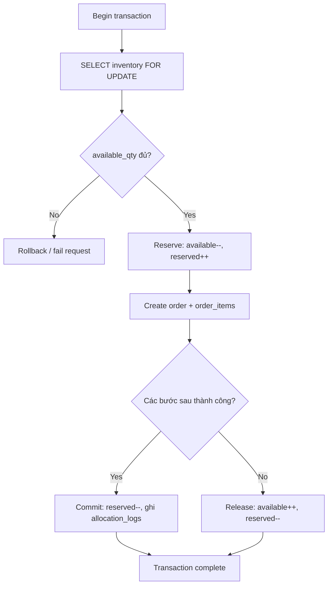
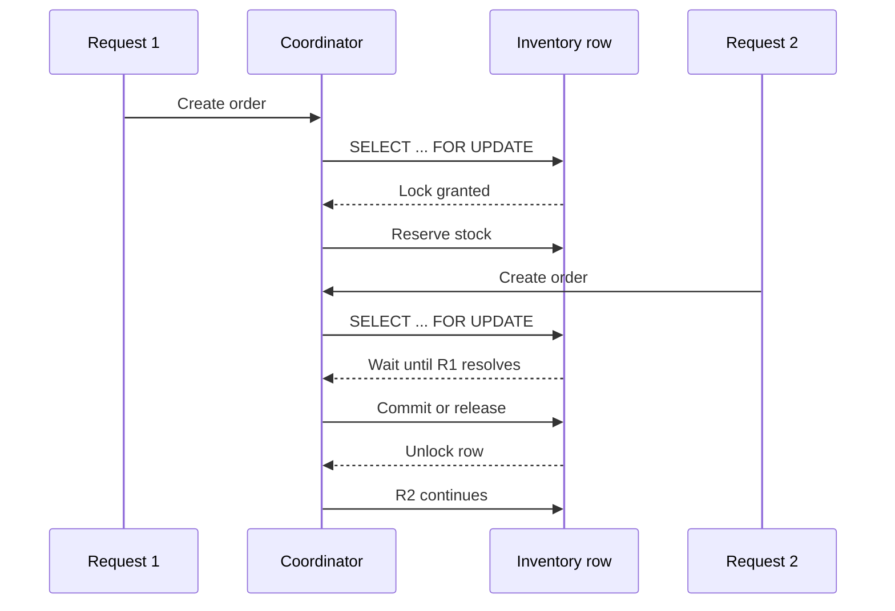

# Đồng thời và nhất quán tồn kho

## 1. Bài toán đặt ra

Trong hệ thống bán hàng đa kho, nhiều người dùng có thể đồng thời đặt cùng một sản phẩm. Nếu các transaction cùng đọc dữ liệu tồn kho trước khi có cơ chế khóa, hệ thống rất dễ gặp lỗi:
- mất cập nhật
- ghi đè giao dịch của nhau
- âm tồn kho
- báo cáo sai sau khi đồng bộ

Vì vậy, mục tiêu quan trọng của hệ thống là đảm bảo rằng:
- tồn kho không bao giờ nhỏ hơn 0
- một SKU không bị cấp phát vượt quá số lượng đang có
- request thất bại không để lại trạng thái dở dang

## 2. Khái niệm nhất quán trong bản demo

Nhất quán ở đây được hiểu theo nghĩa thực dụng cho đồ án:
- mỗi lần tạo đơn hàng phải bảo toàn ràng buộc `available_qty >= 0`
- số lượng đã giữ chỗ phải được phản ánh trong `reserved_qty`
- nếu giao dịch không hoàn thành, lượng đã giữ chỗ phải được trả lại
- log audit phải đủ để giải thích điều gì đã xảy ra

## 3. Mô hình xử lý tồn kho

Bảng `inventory` sử dụng hai trường quan trọng:
- `available_qty`: số lượng còn có thể bán ngay
- `reserved_qty`: số lượng đang được giữ chỗ bởi transaction đang xử lý

### Lợi ích của mô hình này
- tách bạch “còn hàng vật lý” và “đã được transaction tạm chiếm”
- dễ giải thích trong báo cáo
- giúp mô phỏng logic reserve / commit / release gần với hệ thống thật

## 4. Cơ chế khóa được áp dụng

Hệ thống dùng:
- `SELECT ... FOR UPDATE`

### Ý nghĩa
Khi transaction A đang đọc và chuẩn bị cập nhật một dòng tồn kho, dòng đó bị khóa ở mức row-level. Nếu transaction B đến sau muốn đọc-cập nhật cùng dòng theo cách tương tự, transaction B phải chờ.

### Tác dụng
- tránh hai transaction cùng lấy một lượng hàng từ cùng một dòng dữ liệu tại cùng thời điểm
- giúp loại bỏ race condition cơ bản gây âm kho

## 5. Chu trình reserve / commit / release

## 5.1. Reserve
1. khóa bản ghi tồn kho bằng `FOR UPDATE`
2. kiểm tra `available_qty >= requested_qty`
3. giảm `available_qty`
4. tăng `reserved_qty`
5. ghi `inventory_audit` với action `reserve`

## 5.2. Commit
1. sau khi order được tạo thành công
2. giảm lại `reserved_qty`
3. ghi `allocation_logs`
4. ghi `inventory_audit` với action `commit`

## 5.3. Release
Nếu transaction thất bại ở giữa:
1. tăng lại `available_qty`
2. giảm `reserved_qty`
3. ghi `inventory_audit` với action `release`

### Sơ đồ xử lý

## 6. Kịch bản đồng thời trong bản demo

Endpoint dùng để minh họa:
- `POST /orders/demo-concurrency`

### Ý tưởng
Hai khách hàng cùng đặt một SKU trong gần như cùng một thời điểm.

Ví dụ:
- khách 1: `CUS-N-02`
- khách 2: `CUS-N-03`
- SKU: `PHN-01`
- quantity: `6`

### Kỳ vọng
- chỉ request nào khóa và reserve hợp lệ mới thành công
- request còn lại có thể fail nếu kho ưu tiên không còn đủ hàng
- sau cùng, tổng tồn kho vẫn hợp lệ và không âm

## 7. Vai trò của inventory_audit

`inventory_audit` là bằng chứng quan trọng để giải thích hệ thống với giảng viên.

Nó cho phép chỉ ra:
- request nào đã reserve
- request nào đã commit
- request nào đã release
- thứ tự thay đổi dữ liệu

Nhờ đó, phần “đồng thời và nhất quán” không chỉ là nói bằng lý thuyết, mà còn có thể chứng minh bằng log dữ liệu thật.

## 8. Sơ đồ tuần tự của concurrency demo

## 9. Nhận xét về mức độ hoàn chỉnh

Bản demo hiện tại không triển khai distributed transaction manager hoàn chỉnh kiểu 2PC thực thụ. Tuy nhiên, với phạm vi đồ án, giải pháp đang dùng là hợp lý vì:
- có khóa mức dòng
- có reserve/commit/release rõ ràng
- có audit log
- có thể chứng minh không âm kho bằng demo thực tế

Nói cách khác, hệ thống đã đáp ứng tốt yêu cầu “mô phỏng giao dịch hoặc đồng thời trong môi trường phân tán” của đề bài.
