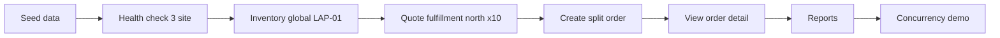

# Runbook demo

## 1. Mục tiêu của runbook

Tài liệu này mô tả cách chạy toàn bộ demo từ đầu đến cuối để phục vụ:
- kiểm tra hệ thống
- demo cho giảng viên
- thuyết trình theo flow rõ ràng
- đối chiếu giữa backend, frontend và dữ liệu thực trong database

## 2. Chuẩn bị môi trường

## 2.1. Backend
1. Cài dependency Python:
   ```bash
   pip install -r requirements.txt
   ```
2. Khởi động 3 PostgreSQL site:
   ```bash
   docker compose up -d
   ```
3. Chạy FastAPI backend:
   ```bash
   python -m uvicorn app.main:app --host 127.0.0.1 --port 8000
   ```

## 2.2. Frontend
1. Cài dependency React:
   ```bash
   npm install --prefix frontend
   ```
2. Chạy frontend Vite:
   ```bash
   npm run --prefix frontend dev -- --host 127.0.0.1 --port 5173
   ```
3. Mở giao diện tại:
   - `http://127.0.0.1:5173`

## 3. Kịch bản demo chuẩn

## Bước 1. Seed dữ liệu
- Thực hiện từ frontend Dashboard hoặc Swagger
- Endpoint:
  - `POST /demo/seed`

### Kết quả mong đợi
- dữ liệu mẫu được nạp vào cả 3 site
- có thể tra inventory và tạo order ngay sau đó

---

## Bước 2. Kiểm tra health phân tán
- Endpoint:
  - `GET /demo/health/distributed`

### Kết quả mong đợi
- 3 site đều trả trạng thái healthy
- frontend hiển thị đủ north, central, south

---

## Bước 3. Tra cứu tồn kho toàn hệ thống
- Endpoint:
  - `GET /inventory/LAP-01/global`

### Kết quả mong đợi
- thấy `LAP-01` còn hàng ở north và south
- tổng available toàn hệ thống là 10
- reserved ban đầu là 0

### Ý nghĩa khi thuyết trình
Đây là bằng chứng rõ nhất cho việc dữ liệu vật lý phân tán nhưng logic hiển thị là toàn cục.

---

## Bước 4. Quote phân bổ đơn hàng
- Endpoint:
  - `POST /inventory/quote-fulfillment`

### Input đề xuất
```json
{
  "sku": "LAP-01",
  "quantity": 10,
  "customer_region": "north"
}
```

### Kết quả mong đợi
- hệ thống ưu tiên north trước
- north cấp 2
- south cấp 8
- `shortfall_qty = 0`

### Ý nghĩa khi thuyết trình
Cho thấy logic điều phối đa kho dựa trên vùng khách hàng và dữ liệu phân tán.

---

## Bước 5. Tạo đơn hàng split order
- Endpoint:
  - `POST /orders`

### Input đề xuất
```json
{
  "customer_code": "CUS-N-01",
  "sku": "LAP-01",
  "quantity": 10,
  "customer_region": "north"
}
```

### Kết quả mong đợi
- tạo được order code mới
- `primary_site_code = north`
- allocation gồm north và south
- inventory ở north và south giảm tương ứng

---

## Bước 6. Xem chi tiết order
- Endpoint:
  - `GET /orders/{order_code}`

### Kết quả mong đợi
- thấy thông tin order
- thấy allocation timeline rõ ràng
- có thể chỉ ra từng warehouse đã cấp bao nhiêu hàng

### Ý nghĩa khi thuyết trình
Đây là bằng chứng trực tiếp cho khái niệm đơn hàng được xử lý bởi nhiều kho khác nhau.

---

## Bước 7. Xem báo cáo tổng hợp
### Endpoint
- `GET /reports/revenue-by-site`
- `GET /reports/top-products`
- `GET /reports/multi-warehouse-orders`

### Kết quả mong đợi
- có doanh thu theo từng site và dòng tổng `all`
- có top sản phẩm bán chạy
- có danh sách đơn hàng multi-warehouse nếu đã tạo split order

### Ý nghĩa khi thuyết trình
Cho thấy dữ liệu phân tán vẫn có thể tạo báo cáo toàn hệ thống.

---

## Bước 8. Demo đồng thời và nhất quán
- Endpoint:
  - `POST /orders/demo-concurrency`

### Input đề xuất
```json
{
  "sku": "PHN-01",
  "quantity_per_order": 6,
  "customer_region": "north",
  "customer_codes": ["CUS-N-02", "CUS-N-03"]
}
```

### Kết quả mong đợi
- một request có thể thành công
- request còn lại có thể thất bại do kho không đủ hàng
- inventory sau cùng không âm
- có thể giải thích bằng `inventory_audit`

## 4. Flow demo gợi ý trên slide


## 5. Checklist trước khi thuyết trình
- [ ] Docker containers của 3 site đang chạy
- [ ] Backend đang lên cổng 8000
- [ ] Frontend đang lên cổng 5173
- [ ] Đã seed dữ liệu mới
- [ ] SKU demo vẫn là `LAP-01`
- [ ] Customer demo vẫn là `CUS-N-01`
- [ ] Reports trả được dữ liệu
- [ ] Concurrency demo không gây âm kho

## 6. Gợi ý khi trả lời phản biện

### Câu hỏi: Vì sao không nhân bản toàn bộ inventory?
Trả lời: vì inventory là dữ liệu cập nhật liên tục, nếu nhân bản toàn phần sẽ tăng chi phí đồng bộ và nguy cơ xung đột.

### Câu hỏi: Vì sao cần coordinator?
Trả lời: vì người dùng cần một góc nhìn logic toàn cục, trong khi dữ liệu vật lý lại phân tán theo site.

### Câu hỏi: Hệ thống có chống âm kho không?
Trả lời: có, thông qua `SELECT ... FOR UPDATE`, reserve/commit/release và `inventory_audit`.

### Câu hỏi: Đây có phải 2PC hoàn chỉnh không?
Trả lời: chưa phải 2PC hoàn chỉnh ở mức production, nhưng đủ để mô phỏng transaction phân tán và nhất quán trong phạm vi đồ án.
